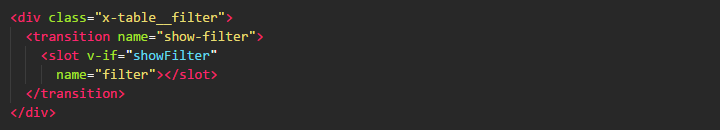
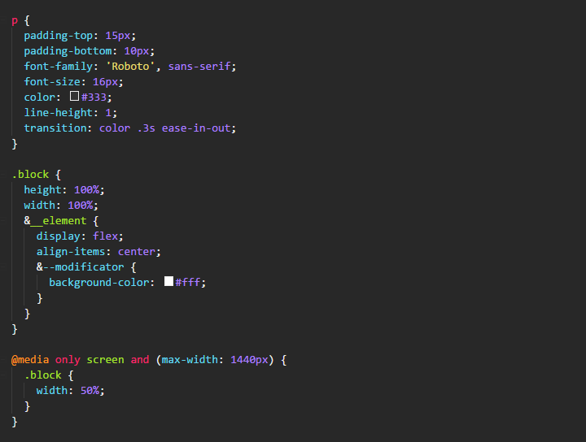

# Monokai GRS
Dark theme based on color shema Monokai

> Theme is not finished yet

## Donate

if you want to support me and my project.

[](https://www.paypal.me/GoliafRS)

## Installation
Launch VS Code, quick open `Ctrl+P`, paste the following command, and press enter.

```
ext install monokai-grs
```

## Screenshot
HTML example code:



CSS example code:



JS example code:


## Credits
- Tested by [Equals182](https://github.com/Equals182)
- Created in [thTheme editor](http://tmtheme-editor.herokuapp.com)

## License
[MIT License](LICENSE)
